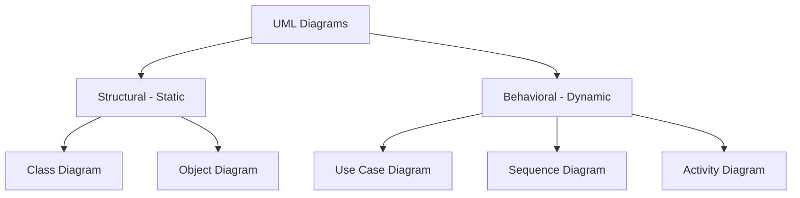

# 01 - UML Fundamentals (Fondamentaux)

### 1. Short Core Summary
**UML (Unified Modeling Language)** is a standardized graphical language used to visualize, specify, and document software systems. It serves as a blueprint for software engineering, allowing developers to model system structure and behavior before implementation.

### 2. Detailed Explanation
- **Definition**: A visual language for modeling software systems. It is not a programming language but a set of notations.
- **Purpose**: To provide a common language for stakeholders and developers to communicate system design.
- **Exam Context**: Professors expect students to distinguish between **Structural** (static) and **Behavioral** (dynamic) diagrams. In Algerian exams, you are often asked to define UML and justify its importance in the software life cycle.

### 3. Key Elements and Notations
- **Structural Diagrams**: Class Diagram, Object Diagram, Component Diagram.
- **Behavioral Diagrams**: Use Case Diagram, Activity Diagram, Sequence Diagram, State Machine Diagram.
- **Common Symbols**:
    - **Stick Figure**: Represents an Actor.
    - **Rectangle**: Represents a Class or a System Boundary.
    - **Arrows**: Represent relationships (Association, Generalization, Dependency).

### 4. Complete Applied Example: System Classification
Consider a **Student Management System**. We can model its static structure (Classes like Student, Course) and its dynamic behavior (Registering for a course).

### 5. Exam Tips & Common Mistakes
- **Notation Precision**: Using the wrong arrow (e.g., solid vs. dashed) is a major cause of point loss.
- **Methodology vs. Notation**: Remember that UML is a **notation**, not a methodology (like UP or Scrum).
- **French Terminology**: Be familiar with terms like "Diagramme de Structure" and "Diagramme de Comportement".

### 6. Short Training Exercise
**Question**: Which category of UML diagrams would you use to model the database structure of a library?
**Solution**: **Structural Diagrams**, specifically the **Class Diagram**, as it represents the static data model of the system.
