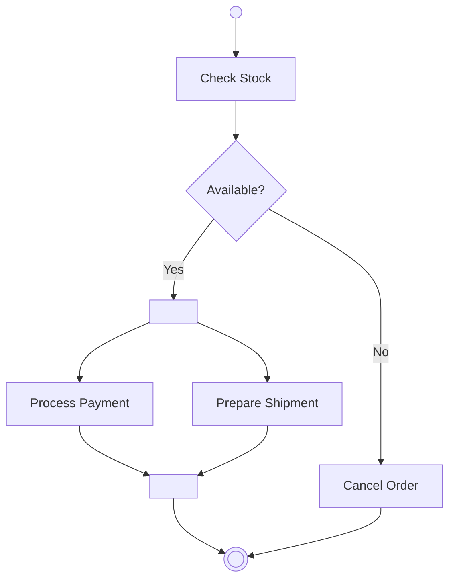

# 03. Activity Diagrams (Diagramme d'activités)

### 📝 Core Summary
The Activity diagram models the **workflow** or business logic of a system. It is similar to a flowchart but supports parallel processing.

---

### 🔍 Detailed Explanation

#### 1. Purpose
To show the sequence of actions, decisions, and concurrent flows required to complete a process.

#### 2. When to use it in Exams?
When you need to explain a complex algorithm, a business process (like an order fulfillment), or how a specific Use Case is executed step-by-step.

---

### 🛠️ Key Elements and Notations
- **Initial Node**: Solid black circle ●.
- **Final Node**: Bullseye ◉.
- **Action**: Rounded rectangle.
- **Decision/Merge**: Diamond ◇.
- **Fork/Join**: Thick horizontal or vertical bars (for parallel tasks).
- **Swimlanes**: Vertical columns to show who (which actor/class) performs which action.

---

### 🏗️ Complete Applied Example: Online Order Process
**Scenario**: A customer submits an order. The system checks stock. If available, it processes payment and ships the item simultaneously.

---

### 💡 Exam Tips & Common Mistakes
- **Tip**: Use **Swimlanes** if the exam asks to show responsibilities between different departments or actors.
- **Mistake**: Forgetting the "Guard Conditions" on decision branches (e.g., `[Yes]` or `[No]`).
- **Mistake**: Not closing a Fork with a Join. If you start parallel paths, you usually need to synchronize them.

---

### ✍️ Short Training Exercise
**Question**: What is the difference between a "Fork" and a "Decision"?
**Solution**: A **Decision** chooses *one* path out of many. A **Fork** splits the flow into *multiple* paths that happen at the same time (concurrency).
