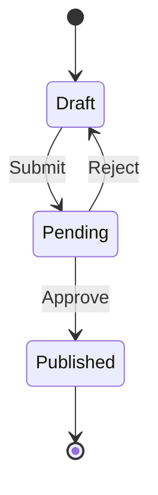

# 04. State Machine Diagrams (États-Transitions)

### 📝 Core Summary
A State Machine diagram shows the **lifecycle** of a single object, focusing on how it changes from one state to another in response to events.

---

### 🔍 Detailed Explanation

#### 1. Definitions
- **State**: A condition during the life of an object (e.g., "Active", "Pending").
- **Transition**: A movement from one state to another, triggered by an event.
- **Event**: An occurrence that triggers a transition (e.g., "buttonClicked").

#### 2. When to use it in Exams?
When the question focuses on the **behavior of a specific object** that has complex logic (e.g., an Order, a User Account, or a Microwave).

---

### 🛠️ Key Elements and Notations
- **State**: Rectangle with rounded corners.
- **Transition Arrow**: Line with an arrow pointing to the next state.
- **Label**: `Event [Guard] / Action` (e.g., `pay [balance > price] / updateBalance`).
- **Initial/Final States**: Same as Activity diagrams (● and ◉).

---

### 🏗️ Complete Applied Example: Document Approval
**Scenario**: A document starts as "Draft". Once submitted, it becomes "Pending". An admin can "Approve" (becomes "Published") or "Reject" (returns to "Draft").

---

### 💡 Exam Tips & Common Mistakes
- **Tip**: Focus on the **Object's perspective**. Ask: "What state is the object in right now?"
- **Mistake**: Confusing this with an Activity diagram. Activity diagrams show *flow of work*; State diagrams show *status of an object*.
- **Mistake**: Missing the initial state. Every state machine must have a starting point.

---

### ✍️ Short Training Exercise
**Question**: Can an object be in two states at the same time in a standard state machine?
**Solution**: No, in a basic state machine, an object is in exactly **one state** at any given time. (Note: Advanced "Composite States" exist but are rarely required in L3 exams).
