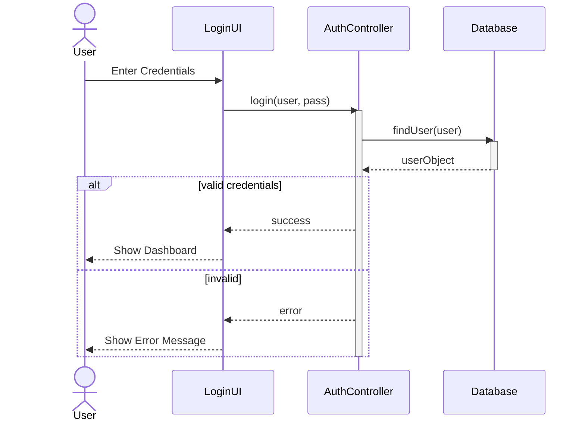

# 05. Sequence Diagrams (Diagramme de séquence)

### 📝 Core Summary
The Sequence diagram is an interaction diagram that shows how objects operate with one another and in what **order** (time sequence).

---

### 🔍 Detailed Explanation

#### 1. Purpose
To visualize the exchange of messages between objects to perform a specific scenario of a Use Case.

#### 2. When to use it in Exams?
When asked to "Model the dynamic interaction" or "Show the messages exchanged between the UI, Controller, and Database."

---

### 🛠️ Key Elements and Notations
- **Lifeline**: Vertical dashed line representing the existence of an object over time.
- **Activation Bar**: Thin rectangle on the lifeline showing when the object is performing an action.
- **Messages**:
  - **Synchronous (`→`)**: Caller waits for a response.
  - **Asynchronous (`->>`)**: Caller continues without waiting.
  - **Return (`-->>`)**: Dashed arrow returning control/data.
- **Fragments (Loops/Alt)**:
  - `alt`: If/Else logic.
  - `loop`: Repetition.

---

### 🏗️ Complete Applied Example: User Login
**Scenario**: A user enters credentials. The System validates them with the Database.

---

### 💡 Exam Tips & Common Mistakes
- **Tip**: Time flows from **top to bottom**.
- **Mistake**: Drawing arrows between lifelines that don't represent actual method calls.
- **Mistake**: Forgetting to label the messages with method names (e.g., `getData()`).

---

### ✍️ Short Training Exercise
**Question**: What does a dashed arrow pointing back to the left usually represent?
**Solution**: It represents a **Return Message**, indicating that a previously called method has finished and is returning a value or control.
