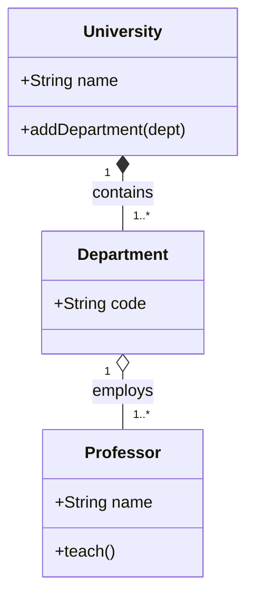

# 06. Class Diagrams (Diagramme de classes)

### 📝 Core Summary
The Class diagram is the most common UML diagram. It describes the **static structure** of a system by showing its classes, attributes, operations, and the relationships among objects.

---

### 🔍 Detailed Explanation

#### 1. Definitions
- **Class**: A blueprint for objects (e.g., `Student`).
- **Attribute**: Data held by the class (e.g., `name: String`).
- **Operation**: Behavior/Method (e.g., `register()`).

#### 2. When to use it in Exams?
When asked to "Design the system architecture" or "Provide a static model of the database/objects."

---

### 🛠️ Key Elements and Notations
- **Visibility**: `+` (Public), `-` (Private), `#` (Protected).
- **Relationships**:
  - **Association**: A simple link between two classes.
  - **Aggregation (`◇`)**: "Has-a" relationship where the part can exist without the whole (e.g., Department and Professor).
  - **Composition (`◆`)**: "Part-of" relationship where the part cannot exist without the whole (e.g., Building and Room).
  - **Generalization (`▷`)**: Inheritance (e.g., Animal and Dog).
- **Multiplicity**: `1`, `*`, `0..1`, `1..*`.

---

### 🏗️ Complete Applied Example: University System
**Scenario**: A University has many Departments. Each Department has many Professors. A Professor belongs to one Department.

---

### 💡 Exam Tips & Common Mistakes
- **Tip**: Always include **multiplicities** on both ends of an association.
- **Mistake**: Confusing Aggregation (empty diamond) and Composition (filled diamond). If the "Whole" is deleted, does the "Part" survive? If yes -> Aggregation. If no -> Composition.
- **Mistake**: Putting method implementation details. Only list the signature: `methodName(param: Type): ReturnType`.

---

### ✍️ Short Training Exercise
**Question**: If a `Car` has an `Engine`, and the engine is destroyed when the car is scrapped, what relationship should be used?
**Solution**: **Composition** (filled diamond `◆`), because the Engine's lifecycle is strictly tied to the Car.
