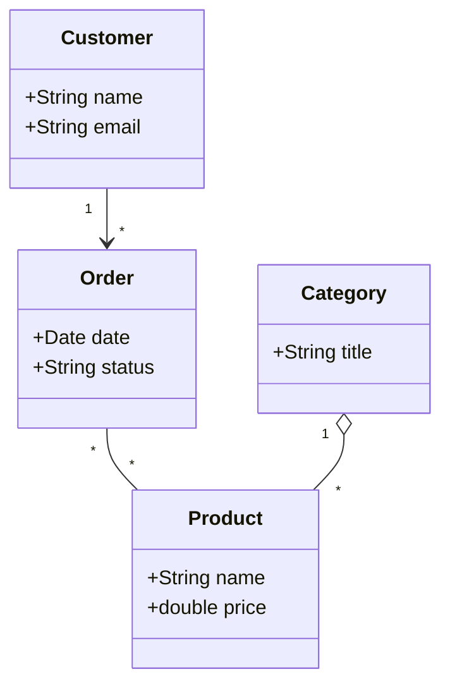
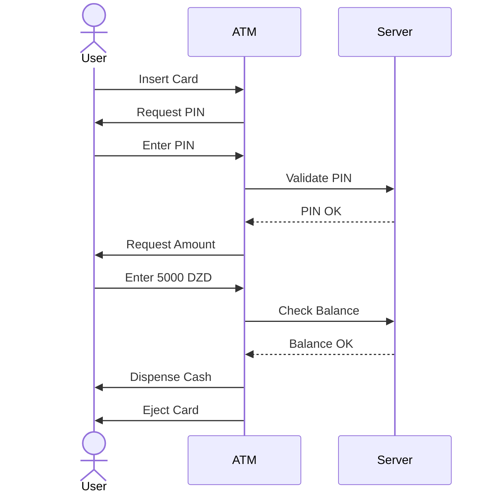

# TD 1: UML Essentials (Solved)

This tutorial focuses on the core UML diagrams frequently encountered in L3 Software Engineering exams.

---

## Exercise 1: Use Case Modeling (Hospital System)
**Scenario**: A patient wants to book an appointment online. The system must allow the patient to search for doctors by specialty. To book, the patient must log in. If it's their first time, they must register. A medical secretary can also view and cancel appointments.

### Tasks:
1. Identify the Actors.
2. Identify the Use Cases.
3. Draw the Use Case Diagram.

### Solution:
1. **Actors**: Patient, Medical Secretary.
2. **Use Cases**: Search Doctor, Book Appointment, Login, Register, View Appointments, Cancel Appointment.
3. **Diagram**:
```mermaid
useCaseDiagram
    actor Patient
    actor Secretary
    
    package "Hospital System" {
        usecase "Search Doctor" as UC1
        usecase "Book Appointment" as UC2
        usecase "Login" as UC3
        usecase "Register" as UC4
        usecase "View Appointments" as UC5
        usecase "Cancel Appointment" as UC6
    }
    
    Patient --> UC1
    Patient --> UC2
    UC2 ..> UC3 : <<include>>
    UC4 ..> UC3 : <<extend>>
    Secretary --> UC5
    Secretary --> UC6
```

---

## Exercise 2: Class Diagram (E-Commerce)
**Scenario**: An online store has Customers who place Orders. Each Order contains multiple Products. A Product belongs to a Category. Customers have a name and email. Orders have a date and status.

### Tasks:
1. Identify Classes and Attributes.
2. Determine Relationships and Multiplicities.

### Solution:
- **Customer** (1) --- (0..*) **Order** (Association)
- **Order** (1..*) --- (1..*) **Product** (Association with multiplicity)
- **Category** (1) --- (0..*) **Product** (Aggregation)



---

## Exercise 3: Sequence Diagram (ATM Withdrawal)
**Scenario**: Model the interaction between a User, the ATM Interface, and the Bank Server for a successful cash withdrawal.

### Solution:

